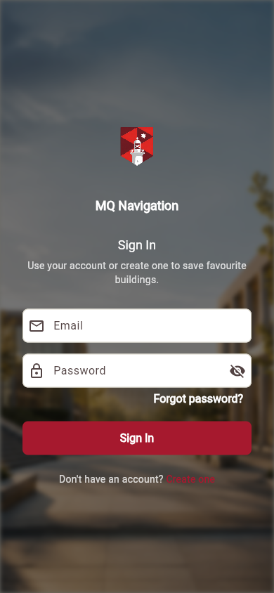
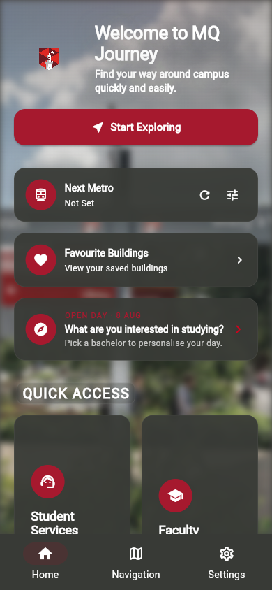
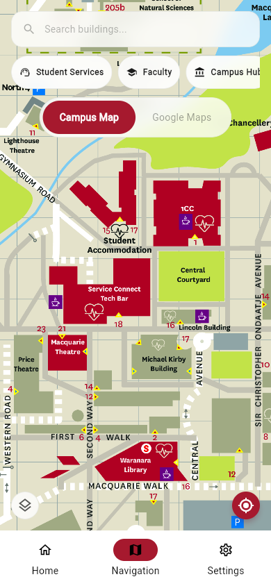
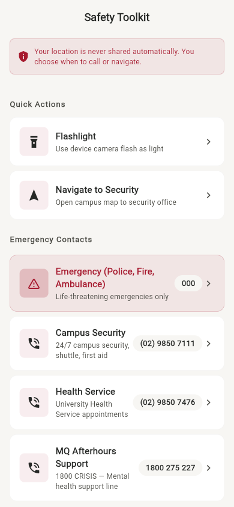
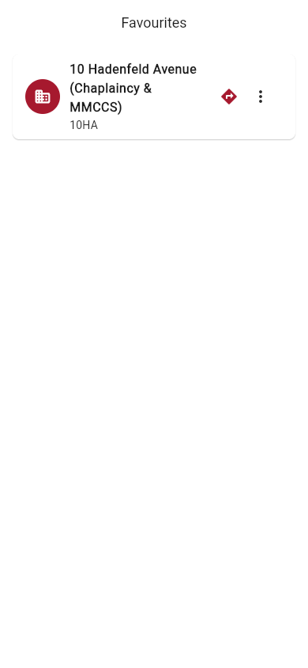
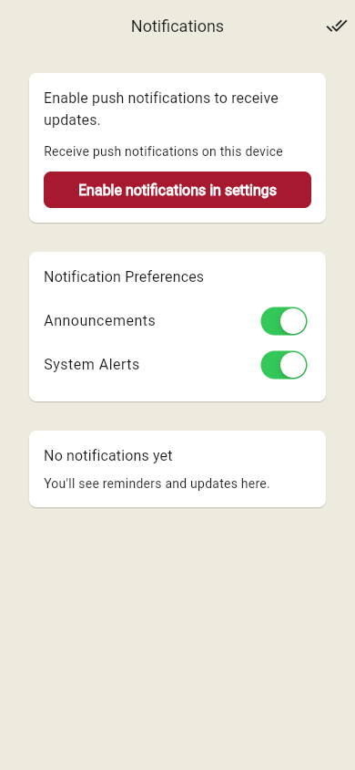
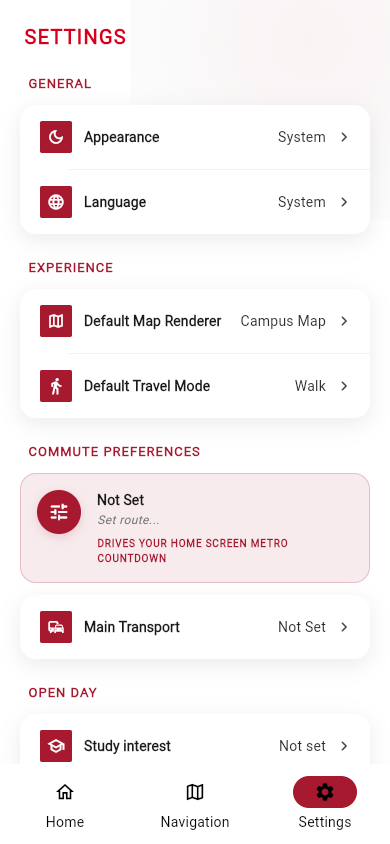
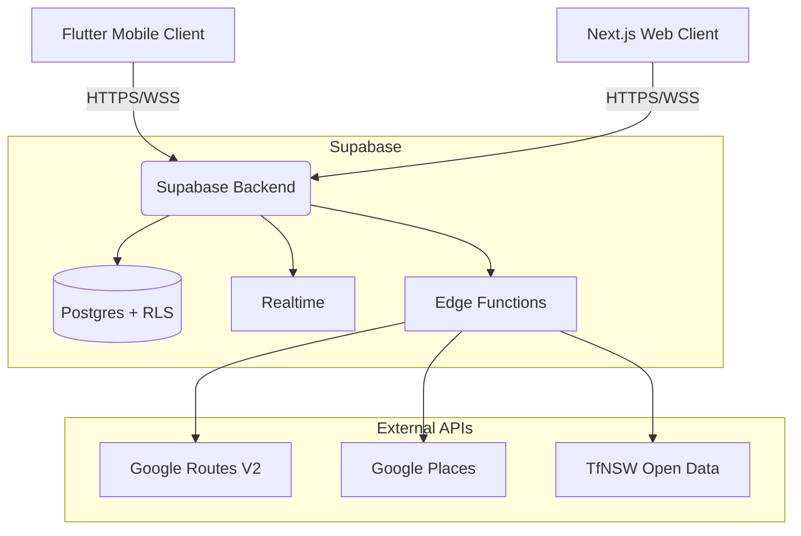

<div align="center">

<!-- Typing animation -->
[](https://readme-typing-svg.demolab.com)

<!-- Badges -->


</div>


<br/>

# MQ Navigation — Privacy-First Campus Companion

> **Find your way around Macquarie — without selling your data.**

A production-ready Flutter client for Macquarie University's campus — dual-renderer maps, turn-by-turn routing, compass mode, campus safety toolkit, transit countdowns, and 35-language i18n. **Privacy by design: optional account, zero tracking, no location history.**

Part of a **two frontends, one backend** architecture sharing a Supabase backend with the [Syllabus Sync](https://github.com/mrpouyaalavi/syllabus-sync) Next.js web application. Submitted for **COMP3130 Mobile App Development — Major Project (May 2026)** and pitched as the official navigation companion for the **Macquarie University Open Day** experience.

**[📖 Project Report](PROJECT_REPORT.md)** &nbsp;·&nbsp; **[📸 Screenshots](screenshots/)** &nbsp;·&nbsp; **[🏗️ Architecture](docs/ARCHITECTURE.md)** &nbsp;·&nbsp; **[🔐 Security Posture](docs/SECURITY_POSTURE.md)**

<br/>


<br/>

## 📌 For Markers — Quick Start

| Step | Action |
|------|--------|
| 1 | `flutter pub get && flutter gen-l10n` |
| 2 | Copy `.env.example` → `.env`. The repo ships with a working Supabase test project anon key — no setup needed for graders. |
| 3 | `flutter run --dart-define-from-file=.env` (Android emulator or Chrome) |
| 4 | Sign in with the test credentials below, or tap **Create one** to register a fresh account. |
| 5 | Tap a building → ❤️ to favourite. Visit the **Favourites** tab to Edit (note) and Delete (kebab menu). |

### Test User Credentials

```
Email:    marker@mq-navigation.test
Password: OpenDay2026!
```

> Use these for the assessment marking pass. A fresh account can also be created from the Sign Up screen — Supabase email-confirmation is disabled on the test project so registration is instant.

### Where to find each rubric requirement

| Requirement | Where it lives |
|-------------|---------------|
| **User authentication** | `lib/features/auth/` — Supabase Auth (login, signup, logout, error mapping, silent existing-user detection) |
| **Remote database (Supabase)** | `favorite_buildings`, `notifications`, `notification_preferences` tables; `lib/features/favorites/data/` and `lib/features/notifications/data/` |
| **CRUD on a data entity** | Favourites: **Create** via ❤️ on any building, **Read** on the Favourites tab, **Update** via the kebab → Edit note, **Delete** via swipe or kebab → Remove |
| **Mobile device service** | `geolocator` (GPS), `flutter_compass` (heading), `torch_light` (flashlight) — all in `lib/features/map/` and `lib/features/safety/` |
| **Widget tests** | `test/features/*/` — 50+ widget tests, including 10 for the Favourites page with full interaction coverage |
| **Unit tests** | 240+ unit tests across map, auth, favourites, notifications, settings, transit, open day |
| **Project Report / Essay** | [`PROJECT_REPORT.md`](PROJECT_REPORT.md) — 820-word essay addressing the required questions (app description, core features, audience personas, competitor advantages, technical credentials, and layout) |

<br/>


<br/>

## 🎯 High-Level Impact & Value Proposition

Existing campus maps either stop at the kerb (Google/Apple Maps don't know which door is *18 Wally's Walk*) or require single sign-on for a poor-quality web experience. MQ Navigation solves this by providing:

- **Dual-Renderer Maps:** Coordinate-aligned switch between Google Maps (traffic, satellite, clustering) and a calibrated illustrated campus raster — both pinpoint the correct **building entrance**, not the road.
- **Turn-by-Turn Routing:** Server-side routing via Supabase Edge proxy with walking, driving, cycling, and transit modes. Arrival detection, off-route recalculation, and a collapsible nav sheet that doesn't stop navigation.
- **Privacy-by-Design Architecture:** Optional account, **zero analytics packages** (CI-enforced), no location history, on-device compass calculation. Encryption via Keychain / Android Keystore.
- **Open Day Ready:** Branded study-interest picker, dynamic event cards, BuildingActionsSheet shared with [Syllabus Sync](https://github.com/mrpouyaalavi/syllabus-sync) deep-link contract.

<br/>

## Why This Project Matters

Most campus apps are dated, English-only, and trade student data for the convenience of a "free" Google Maps embed. MQ Navigation was built to prove three things:

1. **A privacy-respecting campus app is technically achievable.** Real GPS, real routing, real building markers, real safety contacts — and zero analytics SDKs. The CI privacy guard refuses to compile the app if any tracking package is added.
2. **Localisation can be a first-class concern, not an afterthought.** 35 ARB locales with full RTL support for Arabic, Farsi, Hebrew, and Urdu. Tested on real screens, not just `flutter gen-l10n` output.
3. **Two frontends, one backend** is a credible architecture. The same Supabase project powers this Flutter client and the Syllabus Sync Next.js platform — sharing data models, auth users, and Edge Functions without forcing a single UI.

<br/>


<br/>

## Screenshots

<div align="center">

| Login | Home |
|:---:|:---:|
|  |  |

| Map | Safety |
|:---:|:---:|
|  |  |

| Favourites | Notifications | Settings |
|:---:|:---:|:---:|
|  |  |  |

</div>

<br/>


<br/>

## Key Features

```text
╔══════════════════════════════════════════════════════════════════════╗
║  🗺  Dual-renderer maps: Google Maps + calibrated illustrated campus ║
║  🧭  On-device compass mode with bearing-to-destination arrow        ║
║  🛣  Turn-by-turn routing via Supabase Edge proxy → Google Routes V2 ║
║  ❤️  Favourites CRUD: heart-toggle, edit-note, swipe-to-delete       ║
║  🚨  Campus Safety Toolkit: 000, AEDs, first aid, shuttle, torch     ║
║  🚆  Live Macquarie Uni metro countdown via TfNSW Open Data proxy    ║
║  🌍  35 locales · Full RTL for ar/fa/he/ur · WCAG-aware semantics    ║
║  🔐  Optional auth · Zero analytics · CI-enforced privacy guard      ║
║  ⚡  323 tests · 0 analyzer issues · 8-step quality gate script       ║
╚══════════════════════════════════════════════════════════════════════╝
```

<br/>


<br/>

## 🏗️ Technical Architecture Overview

MQ Navigation is built on a modern Flutter stack designed for offline resilience, type safety, and zero-trust privacy.

### System Architecture



### Runtime Stack

| Layer | Technology |
|-------|-----------|
| **Framework** | Flutter 3.11+ (Stable channel) |
| **State** | Riverpod 3.2 (AsyncNotifier) |
| **Routing** | GoRouter 17.1 (StatefulShellRoute, 4 tabs + standalone routes) |
| **Maps** | google_maps_flutter 2.15 / flutter_map 8.2 |
| **Backend** | Supabase (Postgres, RLS, Realtime, Deno Edge Functions) |
| **Location** | geolocator 14 (raw GPS + last-known fallback, emulator mock rejection) |
| **Compass** | flutter_compass 0.8 |
| **Notifications** | Firebase Messaging + flutter_local_notifications 21 |
| **i18n** | flutter_localizations + intl — 35 ARB locales, RTL for ar/fa/he/ur |
| **Security** | flutter_secure_storage 10 (iOS Keychain / Android Keystore) |

### Key Architectural Decisions

- **Defensive bootstrap with timeouts:** `Firebase.initializeApp()` and `Supabase.initialize()` are both wrapped in `.timeout()` calls so the app cannot hang on a stalled network during cold start (root cause we hit during Release-mode testing).
- **Silent existing-user detection:** `AuthRepository.signUp` inspects `response.user.identities` to detect when Supabase silently returns an existing-confirmed account and shows a real error instead of a misleading "Account created" banner.
- **Renderer-aware Building actions:** `BuildingActionsSheet` distinguishes "View in Campus Map" (marker only) from "Navigate with Google Maps" (route preview auto-loaded) via a `?preview=route` query parameter.
- **CI privacy guard:** `scripts/check.sh` refuses to compile if any analytics package (`firebase_analytics`, `google_analytics`, `appsflyer`, `amplitude`, `mixpanel`, `segment`, `sentry_flutter`, `facebook_app_events`) is added to `pubspec.yaml`.

> **Deep Dive:** [`docs/ARCHITECTURE.md`](docs/ARCHITECTURE.md) · [`docs/SECURITY_POSTURE.md`](docs/SECURITY_POSTURE.md) · [`docs/route_matrix.md`](docs/route_matrix.md)

<br/>


<br/>

## 🔒 Privacy Posture & Hardening

Privacy is a structural constraint, not a feature flag. Every line of code is audited against the **privacy-by-default** principle below.

| Principle | Enforcement |
|-----------|------------|
| Optional account | Auth is **fully optional** — the app works at `/home` without login. Account only needed for cloud-synced favourites. |
| Zero tracking | No analytics, telemetry, or crash reporting packages. CI guard blocks them at PR time. |
| No location history | GPS used ephemerally — never persisted, never transmitted to any external service. |
| Local-only preferences | Theme, locale, commute mode, and quiet hours stored via `SharedPreferences` + `FlutterSecureStorage`. |
| Safety privacy | Emergency contacts use tap-to-dial — location is **never automatically shared**. |
| Compass privacy | All heading calculation happens on-device. No data leaves the phone. |

> **Defence-in-depth model:** [`docs/SECURITY_POSTURE.md`](docs/SECURITY_POSTURE.md) · [`docs/key_inventory.md`](docs/key_inventory.md)

<br/>


<br/>

## Who is this for?

We designed MQ Navigation around four real user personas — the people we'd hand a phone to on Open Day and watch them use it.

| Persona | Goals | Why this app over competitors |
|---------|-------|------------------------------|
| **"Open Day Olivia"** — Year 12 prospective student visiting campus for the first time. | Find the Faculty of Arts building, the Library, and where her parents parked. Pin places to return to. | Built-for-Macquarie illustrated campus map with 161 named buildings — Google Maps shows roads, not which door is *18 Wally's Walk*. |
| **"Commuter Chen"** — First-year domestic student catching the Metro from Tallawong. | Know if he's late for his 9am tutorial. Find the nearest defibrillator if a friend collapses at the gym. | Live Macquarie Uni metro countdown on the home screen + the Safety Toolkit one tap away. No other campus app surfaces both. |
| **"International Isha"** — New PhD student from Mumbai, navigating campus in her second language. | Read the app in Hindi or English. Save the rooms her supervisor mentioned. | Full 35-language i18n (with RTL for Arabic, Farsi, Hebrew, Urdu) — most campus apps are English-only. |
| **"Accessibility Alex"** — Low-vision student who uses a screen reader. | High-contrast map mode, no flashing animations, predictable navigation. | Reduced-motion toggle, high-contrast map mode, semantic widgets throughout, no analytics/tracking SDKs. |

**Why pick MQ Navigation over Google/Apple Maps?** Google Maps stops at the street. We start at the building entrance — and we promise to never sell where you walked.

<br/>


<br/>

## Device Compatibility

| Platform | Status | Notes |
|----------|--------|-------|
| **Android emulator** (API 33+) | ✅ Full | All features verified. Recommended for marking. |
| **Android physical device** | ✅ Full | Compass, flashlight, GPS, push notifications all functional. |
| **Chrome (web)** | ✅ Core | Auth, favourites CRUD, maps, routing, transit countdown work. Compass mode and flashlight gracefully degrade — the UI displays an "unsupported on this device" fallback. |
| **iOS device** | ✅ Full | Native build verified on iPhone (iOS 17+). Custom URL scheme `io.mqnavigation://` registered for auth callbacks. |
| **macOS desktop** | ✅ Core | Location, auth, and dual-renderer all functional. CFBundleURLTypes registered so auth deep links return to the app. Google Maps falls back to OSM (plugin limitation). |

If a platform-specific issue surfaces during marking, the relevant feature renders a typed `MapStateError` fallback rather than crashing.

<br/>


<br/>

## Repository Layout

```text
lib/
├── app/              Bootstrap, router, theme, l10n (35 ARB locales)
├── core/             Config, error handling, logging, networking, security
├── shared/           Extensions, models, widgets (MqButton, MqCard, MqInput)
└── features/
    ├── auth/         Supabase Auth (login, signup, session persistence, gate)
    ├── favorites/    Building favourites CRUD (controller, repo, datasource, UI)
    ├── home/         Welcome dashboard, onboarding, metro countdown
    ├── map/          Dual-renderer, routing, compass mode, search, favourites
    ├── safety/       Safety toolkit, emergency contacts, first aid / AED
    ├── notifications/ FCM push, local reminders, inbox
    ├── open_day/     Open Day events, study interest, reminders
    ├── settings/     Preferences, privacy badge, data wipe, account management
    ├── transit/      Metro/bus/train search, commute prefs
    ├── timetable/    Unit and class schedule management
    └── deep_link/    Syllabus Sync deep link contract

test/                 323 widget & unit tests (Vitest-equivalent suite)
supabase/             Edge Functions (maps-routes, tfnsw-proxy)
docs/                 9 reference documents (architecture, security, inventories)
screenshots/          7 screen captures used in this README
scripts/              run.sh, check.sh (quality gate)
```

> **Full Inventory:** [`docs/map_inventory.md`](docs/map_inventory.md) · [`docs/endpoint_inventory.md`](docs/endpoint_inventory.md) · [`docs/entity_inventory.md`](docs/entity_inventory.md)

<br/>


<br/>

## Quick Start

### Prerequisites
- Flutter `3.11+` ([install guide](https://docs.flutter.dev/get-started/install))
- Android SDK / Xcode (for device builds)
- A Supabase project with the [`maps-routes`](supabase/functions/maps-routes/) Edge Function

### Setup
```bash
# Clone and install
git clone <repo-url>
cd mq_navigation
flutter pub get

# Configure environment
cp .env.example .env
# Edit .env with your Supabase + Google Maps credentials
# (see docs/env_inventory.md for the full variable list)

# Generate localisations
flutter gen-l10n

# Run the app
flutter run --dart-define-from-file=.env
# Or via convenience script:
./scripts/run.sh
```

### Quality Assurance
```bash
./scripts/check.sh             # 9 steps (includes debug APK build)
./scripts/check.sh --quick     # 8 steps (skips build)
./scripts/check.sh --fix       # auto-format instead of read-only check
./scripts/check.sh --verbose   # stream command logs to terminal
```

| Step | What it enforces |
|------|-----------------|
| `flutter pub get` | Valid dependency resolution |
| `dart format` | Code formatting (`lib/`, `test/`, `scripts/`, `integration_test/`) |
| `flutter analyze` | Static analysis with hardened lint rules — **0 issues required** |
| `flutter test` | **323 tests** — 100% pass required |
| `flutter gen-l10n` | Localisation generation (35 locales) |
| Untranslated check | `.dart_tool/untranslated.json` — new keys tracked as non-blocking |
| **Privacy guard** | **Blocks** `firebase_analytics`, `google_analytics`, `appsflyer`, `amplitude`, `mixpanel`, `segment`, `sentry_flutter`, `facebook_app_events` |
| **Secret scan** | Flags hardcoded API keys (`sk-*`, `AIza*`) in `lib/` `test/` `scripts/` |
| `flutter build apk --debug` | Android APK compiles (skipped with `--quick`) |

<br/>


<br/>

## Documentation Map

| Document | Path |
|----------|------|
| Project Report (essay) | [`PROJECT_REPORT.md`](PROJECT_REPORT.md) |
| Architecture | [`docs/ARCHITECTURE.md`](docs/ARCHITECTURE.md) |
| Security Posture | [`docs/SECURITY_POSTURE.md`](docs/SECURITY_POSTURE.md) |
| Endpoint Inventory | [`docs/endpoint_inventory.md`](docs/endpoint_inventory.md) |
| Entity Inventory | [`docs/entity_inventory.md`](docs/entity_inventory.md) |
| Environment Variables | [`docs/env_inventory.md`](docs/env_inventory.md) |
| API Keys & Service Accounts | [`docs/key_inventory.md`](docs/key_inventory.md) |
| Map Inventory | [`docs/map_inventory.md`](docs/map_inventory.md) |
| Notification Matrix | [`docs/notification_matrix.md`](docs/notification_matrix.md) |
| Route Matrix | [`docs/route_matrix.md`](docs/route_matrix.md) |
| Contributing | [`CONTRIBUTING.md`](CONTRIBUTING.md) |
| Agent Rules & Changelog | [`AGENT.md`](AGENT.md) |

<br/>


<br/>

## 🎯 Project Governance

### License
Released under the **MIT License**. See [`LICENSE`](LICENSE).

### Roadmap & Priorities
- **P0:** Open Day 2026 demo readiness (DONE).
- **P1:** Hosted HTTPS callback page so the email-confirmation flow works on desktop browsers without the app installed.
- **P1:** Translator passes on the remaining 26 locales' auth strings.
- **P2:** Universal Links / App Links for first-class deep linking.
- **P2:** Voice-guided turn-by-turn for accessibility.

### Maintainers

| Name | Role |
|------|------|
| Pouya Alavi Naeini | Lead — architecture, mapping engine, infrastructure |
| Raouf Abedini | Co-maintainer — security, backend, Supabase Edge Functions |

<br/>


<br/>

## Acknowledgements

Built with the support of the open-source community. This project benefits from:

- [Flutter](https://flutter.dev/) — Cross-platform UI toolkit.
- [Supabase](https://supabase.com/) — Open-source backend with Row-Level Security.
- [OpenStreetMap](https://www.openstreetmap.org/) — Map tile provider for the Campus Map fallback renderer.
- [TfNSW Open Data](https://opendata.transport.nsw.gov.au/) — Live metro departures.

<br/>

<div align="center">

### `> ping --authors`

```text
> Authors    : Pouya Alavi Naeini — Software Engineer | Raouf Abedini — Back-End Developer
> University : Macquarie University, Sydney, NSW
> Unit       : COMP3130 Mobile App Development — Major Project (50%)
> Submission : [●] READY — 323 tests passing · 0 analyzer issues
```

[](https://www.linkedin.com/in/pouya-alavi/)
[](https://github.com/mrpouyaalavi)
[](mailto:pouya@pouyaalavi.dev)

<br/>

*MQ Navigation is an independent open-source student project and is not officially affiliated with Macquarie University.*

</div>
