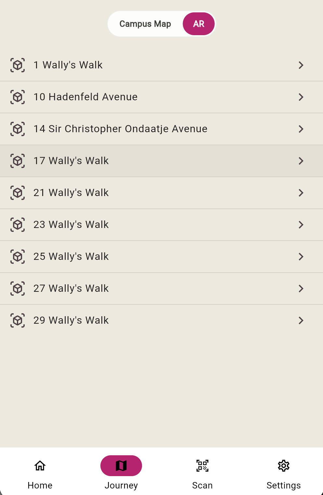
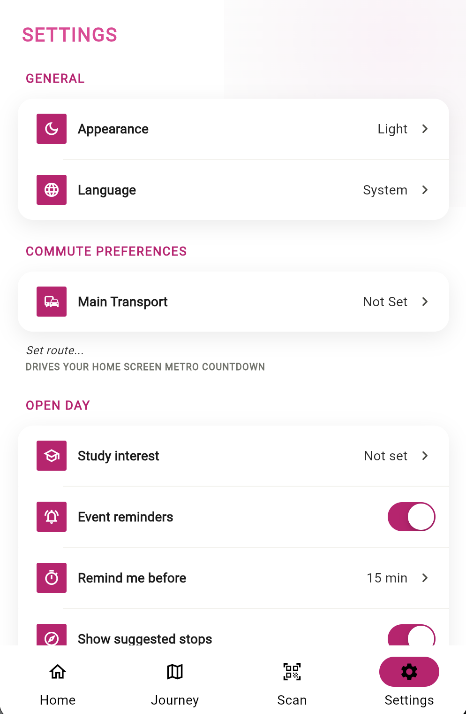
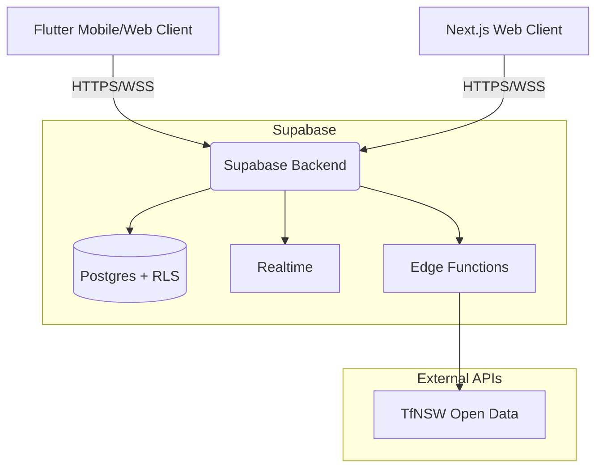

<div align="center">

<!-- Typing animation -->
[](https://readme-typing-svg.demolab.com)

<!-- Badges -->


</div>


<br/>

# MQ Journey — Macquarie University Open Day 2026 Companion

> **Scan. Discover. Plan your day at Macquarie.**

MQ Journey is the official companion app for **Macquarie University Open Day 2026**. Visitors scan a QR code at any building, pick their study interest, and instantly get a personalised view of relevant sessions, suggested stops, an illustrated campus map, and AR/indoor previews — all without creating an account.

Themed around the **Open Day "(OPEN DAY)us" magenta/plum campaign identity**, it shares a Supabase backend with a companion Next.js web app (two frontends, one backend).

**[📖 Project Report](PROJECT_REPORT.md)** &nbsp;·&nbsp; **[📸 Screenshots](screenshots/)** &nbsp;·&nbsp; **[🏗️ Architecture](docs/ARCHITECTURE.md)** &nbsp;·&nbsp; **[🔐 Security Posture](docs/SECURITY_POSTURE.md)**

<br/>


<br/>

## 🎯 What MQ Journey Does

Most Open Day experiences are a printed map and a generic PDF timetable. MQ Journey replaces that with:

- **QR-first entry:** Scan a code on a building or flyer and land directly on that location's card — no app-store search, no account wall.
- **Personalised sessions:** Pick a study interest / degree and see **degree-specific sessions** alongside a separate **"General · Open to all visitors"** track.
- **Suggested stops:** Nearby buildings and activities recommended from the selected interest.
- **Your Day:** Save sessions and stops to a personal running plan for the day.
- **Campus Map:** An illustrated `flutter_map` renderer that pinpoints the correct building entrance, not just a road.
- **AR / Indoor previews:** 360° panorama walkthroughs of select buildings (Pannellum-powered hotspots) reached from the Scan flow.
- **Metro countdown:** Live next-departure times for Macquarie University station via a TfNSW Open Data proxy.
- **35-language i18n**, with full RTL support for Arabic, Farsi, Hebrew, and Urdu.
- **Privacy-first:** No login, no analytics/tracking, no location history — preferences stay on-device.

<br/>


<br/>

## Screenshots

<div align="center">

| Home | Journey / Campus Map |
|:---:|:---:|
|  |  |

| AR / Indoor locations | Scan QR Code |
|:---:|:---:|
|  |  |

| Settings | |
|:---:|:---:|
|  | |

</div>

<br/>


<br/>

## Key Features

```text
╔══════════════════════════════════════════════════════════════════════╗
║  📷  QR scan → instant location card → indoor AR preview             ║
║  🎓  Study-interest picker → degree-specific + "General" sessions    ║
║  📌  Suggested Stops based on selected interest                      ║
║  🗓  "Your Day" — save sessions & stops into a personal plan          ║
║  🗺  Journey tab — illustrated flutter_map campus renderer            ║
║  🕶️  AR / indoor 360° previews with navigable hotspots (Pannellum)   ║
║  🚆  Live Macquarie Uni metro countdown via TfNSW Open Data proxy     ║
║  🌍  35 locales · Full RTL for ar/fa/he/ur · WCAG-aware semantics     ║
║  🔐  No login · Zero analytics · CI-enforced privacy guard            ║
║  ⚡  535 tests · 0 analyzer issues · quality-gate script              ║
╚══════════════════════════════════════════════════════════════════════╝
```

<br/>


<br/>

## 🏗️ Technical Architecture Overview

### System Architecture


```mermaid
graph TD
    A[Flutter Mobile/Web Client] -->|HTTPS/WSS| B(Supabase Backend)
    C[Next.js Web Client] -->|HTTPS/WSS| B

    subgraph "Supabase"
        B --> D[(Postgres + RLS)]
        B --> E[Realtime]
        B --> F[Edge Functions]
    end

    subgraph "External APIs"
        F --> G[TfNSW Open Data]
    end
```

### Runtime Stack

| Layer | Technology |
|-------|-----------|
| **Framework** | Flutter 3.41+ (Stable channel) |
| **State** | Riverpod 3.3 (AsyncNotifier) |
| **Routing** | GoRouter 17 (`StatefulShellRoute`, 4 tabs: Home, Journey, Scan, Settings) |
| **Maps** | flutter_map 8.3 — illustrated campus raster renderer |
| **QR / AR** | mobile_scanner 7 (QR capture) + flutter_inappwebview 6 + Pannellum (indoor 360° hotspots) |
| **Backend** | Supabase (Postgres, RLS, Realtime, Deno Edge Functions) |
| **Transit** | `tfnsw-proxy` Edge Function → TfNSW Open Data (metro countdown) |
| **i18n** | flutter_localizations + intl — 35 ARB locales, RTL for ar/fa/he/ur |
| **Security** | CI-enforced privacy guard (blocks analytics/tracking packages) |

### Key Architectural Decisions

- **Defensive bootstrap with timeouts:** `Firebase.initializeApp()` and `Supabase.initialize()` are wrapped in `.timeout()` calls so the app cannot hang on a stalled network during cold start.
- **Silent anonymous session:** the app boots straight to `/home` (or `/onboarding`) using `signInAnonymously()`. There is no login/signup UI, and CI guards against reintroducing one.
- **QR → location → AR flow:** scanning a code resolves a location card, which can push into an indoor preview served locally via `InAppLocalhostServer` (not `file://`, so panorama references resolve correctly).
- **CI privacy guard:** `scripts/check.sh` refuses to compile if any analytics package (`firebase_analytics`, `google_analytics`, `appsflyer`, `amplitude`, `mixpanel`, `segment`, `sentry_flutter`, `facebook_app_events`) is added to `pubspec.yaml`.

> **Deep Dive:** [`docs/ARCHITECTURE.md`](docs/ARCHITECTURE.md) · [`docs/SECURITY_POSTURE.md`](docs/SECURITY_POSTURE.md) · [`docs/route_matrix.md`](docs/route_matrix.md)

<br/>


<br/>

## 🔒 Privacy Posture

| Principle | Enforcement |
|-----------|------------|
| No login required | Silent anonymous Supabase session on launch — no email/password UI, no account wall. |
| Zero tracking | No analytics, telemetry, or crash-reporting packages. CI guard blocks them at PR time. |
| No location history | GPS/location is used ephemerally for the campus map — never persisted or transmitted elsewhere. |
| Local-only preferences | Theme, locale, and selected study interest stored on-device via `SharedPreferences`. |
| Works without accounts | The full QR → session → Your Day flow requires zero sign-up. |

> **Defence-in-depth model:** [`docs/SECURITY_POSTURE.md`](docs/SECURITY_POSTURE.md) · [`docs/key_inventory.md`](docs/key_inventory.md)

<br/>


<br/>

## Who is this for?

| Persona | Goals | Why this app helps |
|---------|-------|--------------------|
| **"Open Day Olivia"** — Year 12 prospective student visiting for the first time. | Find out what's on for her interest (e.g. Engineering), see where to go next, and remember it later. | Scan a QR → pick her interest → get a curated list of degree-specific and general sessions instead of a generic printed programme. |
| **"Commuter Chen"** — Visiting with family via public transport. | Know when the next Metro departs so the day isn't rushed. | Live Macquarie Uni metro countdown on Home. |
| **"International Isha"** — Visitor who reads more comfortably in her first language. | Use the app in her own language. | 35-locale i18n with full RTL support for Arabic, Farsi, Hebrew, and Urdu. |
| **"Curious Cameron"** — Wants to see inside a building before deciding to walk over. | Preview what a lecture theatre or lab looks like. | AR / indoor 360° previews with navigable hotspots, reached straight from the Scan flow. |

<br/>


<br/>

## Repository Layout

```text
lib/
├── app/              Bootstrap, router, theme (Open Day magenta/plum tokens), l10n (35 ARB locales)
├── core/             Config, error handling, logging, networking, security
├── shared/           Extensions, models, widgets (MqButton, MqCard, MqInput)
└── features/
    ├── home/         Open Day dashboard, onboarding, metro countdown, quick access
    ├── map/           Journey tab — illustrated campus map renderer
    ├── scan/          QR capture, location card, AR/indoor 360° previews
    ├── open_day/      Study-interest picker, degree/general sessions, Your Day
    ├── settings/      Preferences, locale, theme
    ├── transit/       Metro departure lookups (TfNSW)
    ├── auth/          Silent anonymous Supabase session
    ├── deep_link/     External deep-link contract
    ├── favorites/     Legacy building favourites (not on the active 4-tab flow)
    ├── notifications/ Legacy FCM/local notifications (not on the active 4-tab flow)
    ├── safety/        Legacy safety toolkit (not on the active 4-tab flow)
    └── timetable/     Legacy unit/class schedule management

test/                 535 widget & unit tests (Flutter Test suite)
supabase/functions/    Edge Functions (tfnsw-proxy, notify, cleanup-cron, maps-routes)
assets/data/           open_day.json, buildings.json, indoor/ (panorama manifests + images)
assets/web/            indoor_viewer.html + vendored Pannellum assets
docs/                  Reference documents (architecture, security, inventories)
screenshots/           Screen captures used in this README
scripts/               run.sh, check.sh (quality gate)
```

> **Note:** `favorites/`, `notifications/`, `safety/`, and `timetable/` still exist in the codebase and are reachable via named routes, but nothing in the current 4-tab UI (Home / Journey / Scan / Settings) links to them — they predate the Open Day 2026 pivot and are not part of the active user flow.

> **Full Inventory:** [`docs/map_inventory.md`](docs/map_inventory.md) · [`docs/endpoint_inventory.md`](docs/endpoint_inventory.md) · [`docs/entity_inventory.md`](docs/entity_inventory.md)

<br/>


<br/>

## Quick Start

### Prerequisites
- Flutter `3.11+` ([install guide](https://docs.flutter.dev/get-started/install))
- Android SDK / Xcode (for device builds); Chrome for web
- A Supabase project (anon key ships in `.env.example` for local dev)

### Setup
```bash
git clone <repo-url>
cd MQ-Journey
flutter pub get

# Configure environment
cp .env.example .env
# Edit .env with your Supabase / TfNSW credentials — see docs/env_inventory.md

# Generate localisations
flutter gen-l10n

# Run the app (Chrome, Android emulator, or iOS simulator)
flutter run --dart-define-from-file=.env
# Or via convenience script:
./scripts/run.sh

# Deploy the transit proxy only if you've changed it:
supabase functions deploy tfnsw-proxy
```

### Quality Assurance
```bash
flutter analyze lib test     # 0 issues (1 non-blocking deprecation info)
flutter test                 # 535 tests, 100% pass
flutter build web --release  # verified production web build
./scripts/check.sh           # full quality gate (format, analyze, test, l10n, privacy/secret/name guards)
./scripts/check.sh --quick   # skips the debug APK build
```

| Step | What it enforces |
|------|-----------------|
| `dart format` | Code formatting (`lib/`, `test/`, `scripts/`, `integration_test/`) |
| `flutter analyze` | Static analysis — 0 blocking issues |
| `flutter test` | 535 tests — 100% pass required |
| `flutter gen-l10n` | Localisation generation (35 locales) |
| **Privacy guard** | Blocks analytics/tracking packages |
| **Secret scan** | Flags hardcoded API keys in `lib/` `test/` `scripts/` |
| **No-stale-name guard** | Blocks `mq_navigation` references |
| **No-login-route guard** | Blocks any login/signup route or `signInWithPassword` |
| **No-Google guard** | Blocks Google Maps SDK/file references |
| `flutter build apk --debug` | Android APK compiles (skipped with `--quick`) |

<br/>


<br/>

## Documentation Map

| Document | Path |
|----------|------|
| Project Report | [`PROJECT_REPORT.md`](PROJECT_REPORT.md) |
| Architecture | [`docs/ARCHITECTURE.md`](docs/ARCHITECTURE.md) |
| Security Posture | [`docs/SECURITY_POSTURE.md`](docs/SECURITY_POSTURE.md) |
| QR / Scan / Stamp Pipeline | [`docs/qr-card-stamp-pipeline-architecture.md`](docs/qr-card-stamp-pipeline-architecture.md) |
| Endpoint Inventory | [`docs/endpoint_inventory.md`](docs/endpoint_inventory.md) |
| Entity Inventory | [`docs/entity_inventory.md`](docs/entity_inventory.md) |
| Environment Variables | [`docs/env_inventory.md`](docs/env_inventory.md) |
| API Keys & Service Accounts | [`docs/key_inventory.md`](docs/key_inventory.md) |
| Map Inventory | [`docs/map_inventory.md`](docs/map_inventory.md) |
| Route Matrix | [`docs/route_matrix.md`](docs/route_matrix.md) |
| Contributing | [`CONTRIBUTING.md`](CONTRIBUTING.md) |
| Agent Rules & Changelog | [`AGENT.md`](AGENT.md) |

<br/>


<br/>

## 🎯 Project Governance

### License
Released under the **MIT License**. See [`LICENSE`](LICENSE).

### Roadmap
- Polish AR hotspot accuracy and finish missing panorama images for remaining indoor buildings.
- Refresh `assets/data/open_day.json` with the official Open Day 2026 programme once published.
- Harden the web/mobile release build pipeline (CI-driven `flutter build web` / signed APK).
- Add up-to-date screenshots and a short demo video/GIF (see TODOs in the Screenshots section).
- Deploy a public web demo and link it here.
- Explore native app-store packaging (Play Store / App Store) as a stretch goal.

### Maintainers

| Name | Role |
|------|------|
| Pouya Alavi Naeini | Flutter app, Open Day UX/personalisation, frontend integration |
| Raouf Abedini | QR/Scan/AR flow, Supabase backend and Edge Functions |

<br/>


<br/>

## Acknowledgements

- [Flutter](https://flutter.dev/) — Cross-platform UI toolkit.
- [Supabase](https://supabase.com/) — Open-source backend with Row-Level Security.
- [Pannellum](https://pannellum.org/) — Open-source panorama viewer powering the AR/indoor previews.
- [TfNSW Open Data](https://opendata.transport.nsw.gov.au/) — Live metro departures.

<br/>

<div align="center">

### `> ping --authors`

```text
> Authors    : Pouya Alavi Naeini — Software Engineer | Raouf Abedini — Back-End Developer
> University : Macquarie University, Sydney, NSW
> Product    : Macquarie University Open Day 2026 companion
> Status     : [●] 535 tests passing · 0 blocking analyzer issues
```

<br/>

</div>
